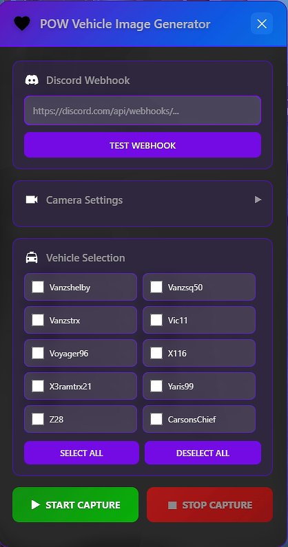
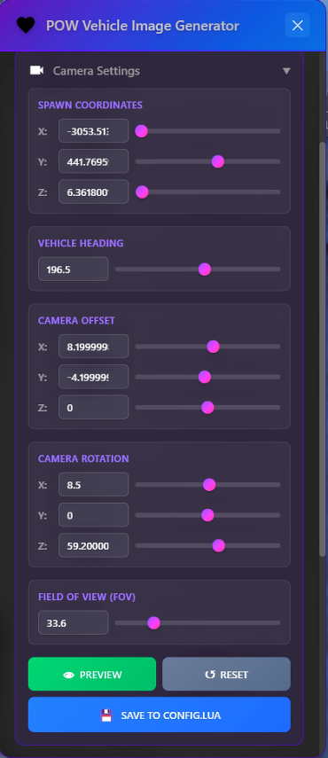

# Vehicle Image Generator

Capture vehicle screenshots for your FiveM server and upload them to Discord.




**Features:**
- Takes screenshots of vehicles automatically
- Uploads to Discord webhooks
- Adjustable camera with sliders
- Bulk capture with progress bar
- Saves URLs to JSON file

## Setup ##

## Dependencies

- `screenshot-basic`

**1. Installation**
```
ensure screenshot-basic
ensure vehicle-image-generator
```

**2. Admin Permission** (server.cfg)
```
add_ace group.admin command.vehui allow
```

**3. Add Vehicles** (config.lua)
```lua
Config.VehicleSpawnCodes = {
    "adder",
    "t20",
    "zentorno",
}
```

**4. Restart server**

**Commands:**
- Input '/vehui' in game to open the NUI for the script
- Input 'clearimages' into your TxAdmin live console to remove all taken images from the .JSON file

1. Paste your Discord webhook URL
2. Adjust camera if needed (use the sliders)
3. Select vehicles from the list
4. Click START CAPTURE
5. Wait for progress bar to finish

## Camera Settings

Click the Camera Settings header to expand. You can adjust:
- Spawn position (X, Y, Z coords)
- Vehicle rotation
- Camera position/angle
- FOV (zoom)

Changes save automatically to config.lua

## Why Download Images?

**Don't use Discord URLs directly in your server.** Discord CDN links expire after a few hours/days (notice the `ex=` parameter). If you use them in your vehicle shop, all your images will break.

**Solution:** Download the images and upload them to permanent hosting (GitHub, Imgur, your own website, etc.)

## How to Download

Right-click `download-images.ps1` and select "Run with PowerShell"

Or open PowerShell and run:
```
cd vehicle-image-generator
./download-images.ps1
```

This downloads all images from `vehicle-images.json` to the `downloaded-images` folder. Then upload those files to your hosting and use those permanent URLs in your shop config.

## Using the Images

After uploading to permanent hosting, use the URLs in your vehicle shop:

```lua
{ model = 'adder', name = 'Adder', image = 'https://your-hosting.com/adder.webp' }
```

Or use the export:
```lua
local imageUrl = exports['vehicle-image-generator']:GetVehicleImage('adder')
```

vehicle-images.json format:
```json
{
  "adder": {
    "imageUrl": "https://cdn.discordapp.com/...",
    "model": "adder",
    "label": "Adder"
  }
}
```

## Configuration

Add your vehicles in `config.lua`:
```lua
Config.VehicleSpawnCodes = {
    "adder",
    "t20",
    "zentorno",
}
```

Change camera defaults (optional):
```lua
Config.CameraSettings = {
    spawnCoords = vector3(-40.0, -1101.0, 26.5),
    heading = 70.0,
    cameraOffset = vector3(0.0, -8.0, 2.0),
    fov = 50.0,
    pointAtOffset = vector3(0.0, 0.0, 0.5)
}
```

## Support

Current Issues >
- Saving NUI settings to config don't appear to be working correctly.
- Players MUST be on solid ground when running the script & taking images.
- All players in the server MUST be near where the car spawns otherwise textures bug out.
- Make sure you're not in no clip & don't have a gun in your hands.
- After closing the NUI the settings don't save.
- The script must be restarted if you click on the stop capture button.
- The script can easily take around 50-80 images at a time (Don't over work it at one time)

Still stuck & having issues?... Figure it out or wait until I get around to looking into the issues. xD

---

Made by POW

