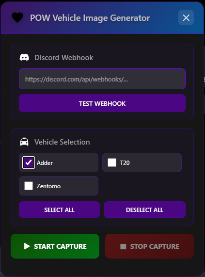

# Vehicle Image Generator

Capture vehicle images for your FiveM server with Discord webhooks.



**What it does:**
- Automatically captures vehicle screenshots
- Uploads directly to Discord
- Saves image URLs for use in vehicle shops
- Bulk processing with progress tracking

## Setup ##

## Dependencies

- `screenshot-basic` (included with FiveM)

**1. Installation**
---
ensure screenshot-basic
ensure vehicle-image-generator
---

**2. Admin Permission** (server.cfg)
---
add_ace group.admin command.vehui allow
---

**3. Add Vehicles** (config.lua)
```lua
Config.VehicleSpawnCodes = {
    "adder",
    "t20",
    "zentorno",
}
---

**4. Restart server**

## Usage

In-game, type `/vehui`

1. Paste Discord webhook URL
2. Select vehicles
3. Click START CAPTURE
4. Done

Get webhook: Discord → Server Settings → Integrations → Webhooks

## Using the Images

**Export method:**
```lua
local imageUrl = exports['vehicle-image-generator']:GetVehicleImage('adder')
```

**Or copy from vehicle-images.json:**
```json
{
  "adder": {
    "imageUrl": "https://cdn.discordapp.com/...",
  }
}
```

Use in your vehicle shop:
```lua
{ model = 'adder', name = 'Adder', image = 'https://cdn.discordapp.com/...' }
```

## Configuration

**Add your vehicles** in `config.lua`:
```lua
Config.VehicleSpawnCodes = {
    "adder",
    "t20",
    "zentorno",
}
```

**Adjust camera** (optional):
```lua
Config.CameraSettings = {
    coords = vector3(-40.0, -1101.0, 26.5),
    heading = 70.0,
    fov = 50.0
}
```

## Support

**Issues?** Figure it out. xD   
**Questions?** Check the config file - it's well documented

---

Made by POW
